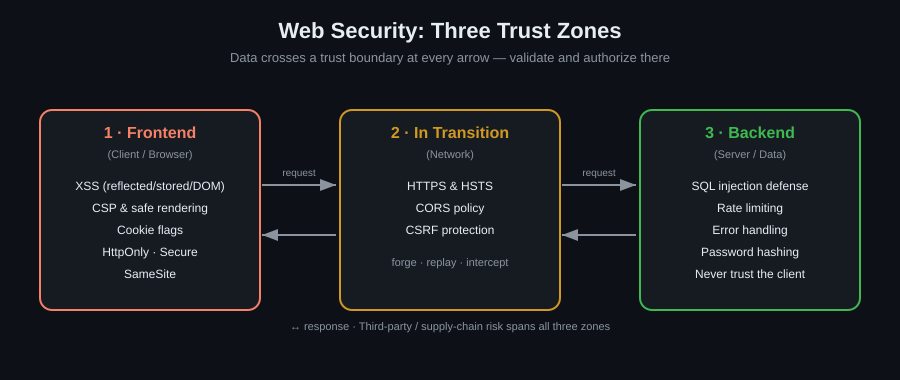
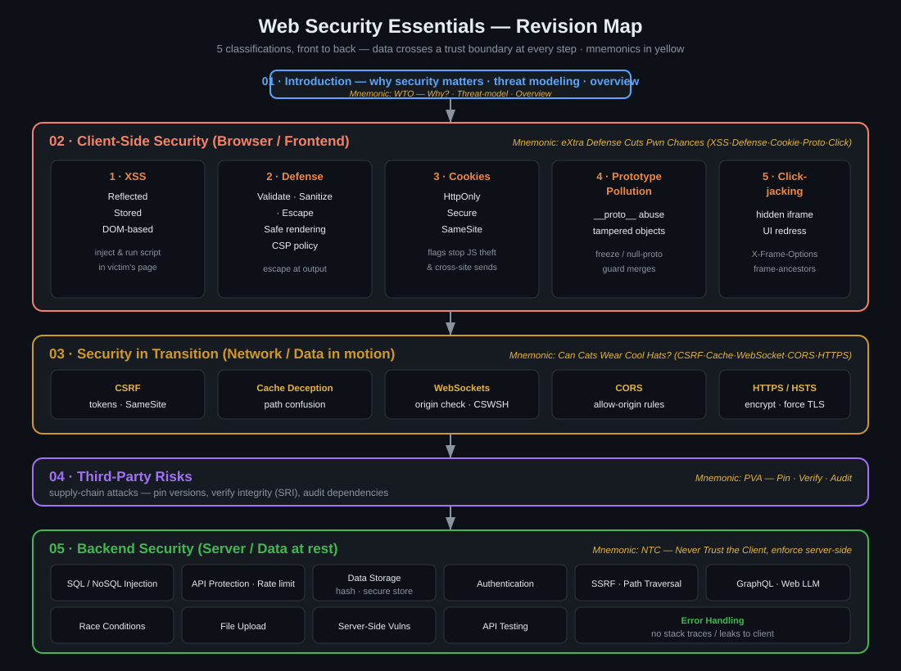
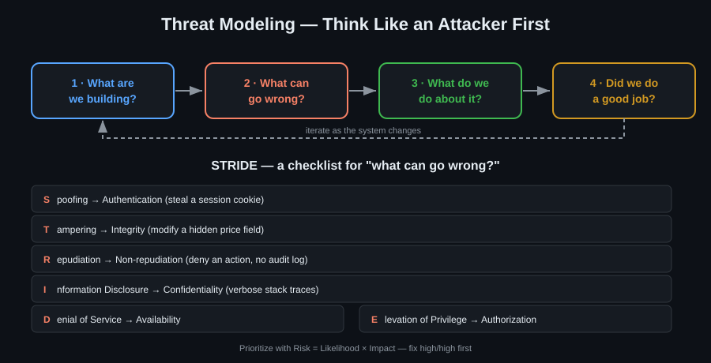
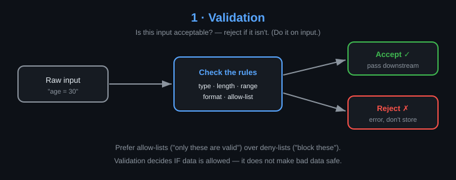
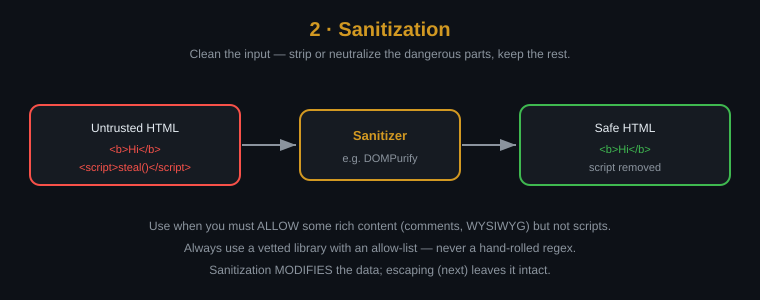
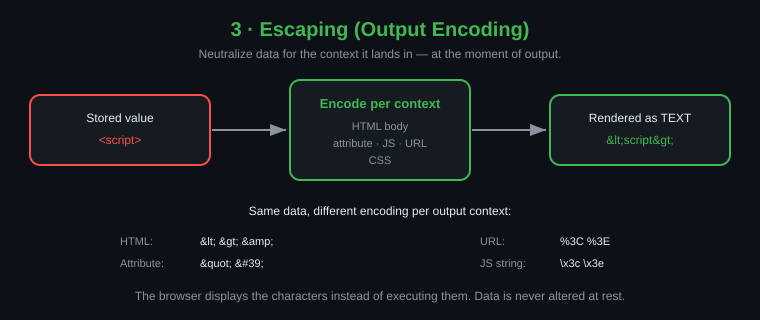

<div align="center">

# 🛡️ Web Security Mastry

### A Comprehensive Lab for Web Vulnerabilities & Defensive Engineering


**Building Secure Systems for the Modern Web**

</div>

## 🗺️ Security Zones

Every topic in this repo maps to one of three trust zones — the **frontend**
(browser), the **transition** (network), and the **backend** (server). Data
crosses a trust boundary at every arrow, and that is where it must be validated
and authorized.

<div align="center">

</div>

New here? Start with [why-security-matters](01_Introduction/why-security-matters.md),
then [security-overview](01_Introduction/security-overview.md) and
[threat-modeling](01_Introduction/threat-modeling.md).

## 🔁 Revision Map

One page to revise the whole repo — all 5 classifications front to back, with
client-side security expanded into its 5 sub-topics.

<div align="center">

</div>

**Mnemonics** — memorise the phrase, unpack the topics:

| Section | Mnemonic | Unpacks to |
|---|---|---|
| 01 · Introduction | **WTO** | **W**hy? · **T**hreat-model · **O**verview |
| 02 · Client-Side | **eXtra Defense Cuts Pwn Chances** | **X**SS · **D**efense · **C**ookies · **P**rototype Pollution · **C**lickjacking |
| 03 · In Transition | **Can Cats Wear Cool Hats?** | **C**SRF · **C**ache Deception · **W**ebSockets · **C**ORS · **H**TTPS/HSTS |
| 04 · Third-Party | **PVA** | **P**in versions · **V**erify integrity (SRI) · **A**udit deps |
| 05 · Backend | **NTC** | **N**ever **T**rust the **C**lient — validate & enforce server-side |

## 🧠 Threat Modeling

Think like an attacker before they do — the four questions plus a STRIDE pass.

<div align="center">

</div>

## 🧼 Handling Untrusted Input: Validation vs Sanitization vs Escaping

Three distinct defenses, applied at different stages — do not confuse them.

<div align="center">



</div>

## 📚 Repository Structure

```bash
├── 📁 01_Introduction
│   ├── 📝 security-overview.md
│   ├── 📝 threat-modeling.md
│   └── 📝 why-security-matters.md
├── 📁 02_Client_Side_Security
│   ├── 📝 README.md
│   ├── 📁 01_XSS_Vulnerabilities
│   │   ├── 📝 cross-site-scripting.md
│   │   ├── 📝 dom-based-xss.md
│   │   ├── 📝 reflected-xss.md
│   │   └── 📝 stored-xss.md
│   ├── 📁 02_Defense_Mechanisms
│   │   ├── 📝 csp-policy.md
│   │   ├── 📝 safe-rendering.md
│   │   └── 📝 validation-vs-sanitization-vs-escaping.md
│   ├── 📁 03_Cookie_Security
│   │   ├── 📝 concept.md
│   │   ├── 📝 cookie-flags.md
│   │   └── 📝 httpOnly.md
│   ├── 🎯 04_Prototype_Pollution
│   ├── 🎯 05_Clickjacking
│   ├── 📁 06_Authentication_Security
│   │   └── 📝 concept.md
│   └── 📁 07_Token_Storage_Security
│       └── 📝 concept.md
├── 📁 03_Security_In_Transition
│   ├── 🎯 01_CSRF
│   │   ├── 📝 README.md
│   │   ├── 📝 csrf-attacks.md
│   │   └── 📝 csrf-defenses.md
│   ├── 🎯 02_Web_Cache_Deception
│   │   └── 📝 README.md
│   ├── 🎯 03_WebSockets_Vulnerabilities
│   │   └── 📝 README.md
│   ├── 🎯 04_CORS
│   │   ├── 📝 README.md
│   │   └── 📝 cors-policy.md
│   └── 📁 05_HTTPS_and_HSTS
│       └── 📝 https-and-hsts.md
├── 📁 04_Third_Party_Risks
│   └── 📝 supply-chain-attacks.md
├── 📁 05_Backend_Security
│   ├── 📁 01_SQL_Injection
│   │   ├── 📝 sql-defenses.md
│   │   └── 📝 sql-injection-basics.md
│   ├── 📁 02_API_Protection
│   │   ├── 📝 error-handling.md
│   │   └── 📝 rate-limiting.md
│   ├── 📁 03_Data_Storage
│   │   ├── 📝 password-hashing.md
│   │   └── 📝 secure-storage.md
│   ├── 🎯 04_API_Testing
│   │   └── 📝 README.md
│   ├── 🎯 05_Server_Side_Vulnerabilities
│   │   └── 📝 README.md
│   ├── 🎯 06_SQL_Injection
│   │   └── 📝 README.md
│   ├── 🎯 07_Web_LLM_Attacks
│   │   └── 📝 README.md
│   ├── 🎯 08_Authentication_Vulnerabilities
│   │   └── 📝 README.md
│   ├── 🎯 09_SSRF
│   │   └── 📝 README.md
│   ├── 🎯 10_GraphQL_API_Vulnerabilities
│   │   └── 📝 README.md
│   ├── 🎯 11_Path_Traversal
│   │   └── 📝 README.md
│   ├── 🎯 12_NoSQL_Injection
│   │   └── 📝 README.md
│   ├── 🎯 13_Race_Conditions
│   │   └── 📝 README.md
│   ├── 🎯 14_File_Upload_Vulnerabilities
│   │   └── 📝 README.md
│   └── 📝 never-trust-the-client.md
├── 📄 LICENSE
└── 📝 README.md
```

> 🎯 = hands-on [PortSwigger Web Security Academy](https://portswigger.net/web-security/learning-paths)
> learning path — each folder has a README with the path link, a progress
> checklist, and space for notes.
